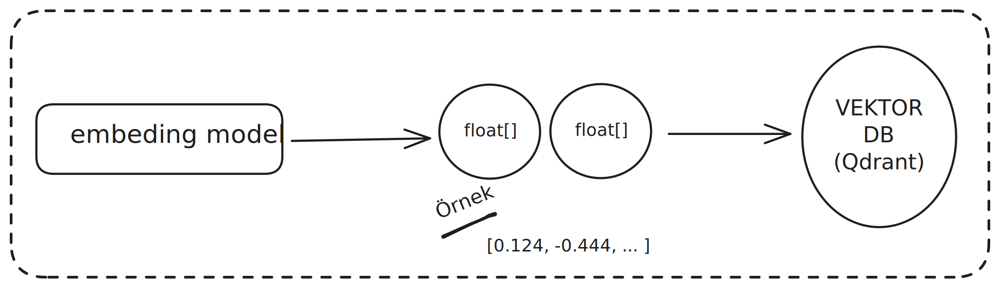

# 🚀 RAG - Retrieval-Augmented Generation Örneği

[](https://www.typescriptlang.org/)
[](https://nodejs.org/)
[](https://opensource.org/licenses/ISC)

Bu proje, **Retrieval-Augmented Generation (RAG)** teknolojisinin nasıl uygulanacağını gösteren açık kaynak bir örnektir. RAG, büyük dil modellerini (LLM) harici bilgi kaynaklarıyla birleştirerek daha doğru ve güncel cevaplar üretmenizi sağlar.

## ✨ Özellikler

- 🔍 **Vektör Tabanlı Arama**: Semantik benzerlik ile en alakalı bilgileri bulma
- 🆓 **Ücretsiz AI Modelleri**: OpenAI API maliyeti olmadan, yerel embedding modeli
- 📚 **Örnek Bilgi Tabanı**: İş süreçleri hakkında 15+ modül bilgisi
- ⚡ **Hızlı Performans**: Qdrant vektör veritabanı ile optimize edilmiş
- 🛠️ **Modüler Yapı**: Kolay genişletilebilir ve özelleştirilebilir mimari
- 🌍 **Çok Dilli Destek**: Türkçe örnek veriler ve arayüz

## ��️ Sistem Mimarisi

### Genel Akış

```
┌─────────────────┐    ┌─────────────────┐    ┌─────────────────┐
│   Kullanıcı     │───▶│   RAG Sistemi   │───▶│  Vektör DB     │
│   Sorusu        │    │                 │    │  (Qdrant)      │
└─────────────────┘    └─────────────────┘    └─────────────────┘
                              │
                              ▼
                       ┌─────────────────┐
                       │  AI Generator   │
                       │ (Hugging Face)  │
                       └─────────────────┘
```

### Detaylı RAG Akış Diyagramı



Bu diyagram RAG sisteminin çalışma prensibini göstermektedir:

1. **Metin Girişi**: Kullanıcı sorusu veya doküman metni
2. **Embedding Model**: Metin vektörlere dönüştürülür (384 boyutlu float dizisi)
3. **Vektör Veritabanı**: Embedding'ler Qdrant'ta saklanır ve aranır
4. **Benzerlik Arama**: En alakalı vektörler bulunur
5. **AI Üretimi**: Bulunan bilgiler AI modeli ile işlenir

## 📋 Örnek Bilgi Tabanı

Bu proje, işletme yönetimi süreçleri hakkında örnek veriler içerir:

| Modül                    | Açıklama                       | Endpoint             |
| ------------------------ | ------------------------------ | -------------------- |
| 🛒 **Sipariş Fişi**      | Müşteri siparişleri yönetimi   | `/siparis-fisi`      |
| 📝 **Satın Alma Talebi** | İhtiyaç toplama ve onay süreci | `/satinalma-talep`   |
| 📊 **Stok Hareketleri**  | Envanter takibi ve raporlama   | `/stok-hareketleri`  |
| 👥 **Cari Kart**         | Müşteri/tedarikçi yönetimi     | `/cari-kart`         |
| 🧾 **Fatura**            | Satış/alış faturaları          | `/fatura-olustur`    |
| 🏖️ **Personel İzin**     | İzin talepleri ve onayları     | `/personel-izin`     |
| 💰 **Kasa İşlemleri**    | Nakit yönetimi                 | `/kasa-islemleri`    |
| 🏦 **Banka Hareketleri** | Banka işlemleri ve mutabakat   | `/banka-hareketleri` |
| 📦 **Depo Transfer**     | Depolar arası ürün transferi   | `/depo-transfer`     |
| 🏭 **Üretim Emirleri**   | Üretim planlama ve takibi      | `/uretim-emirleri`   |
| 📈 **Stok Raporları**    | Envanter analizi               | `/stok-raporlari`    |
| ⚠️ **Risk Kontrolü**     | Müşteri bakiye ve risk takibi  | `/cari-bakiye`       |
| 💼 **Satış Teklifi**     | Müşteri teklifleri             | `/satis-teklifi`     |
| 👷 **Bordro**            | Personel maaş hesaplamaları    | `/bordro`            |
| 📊 **Muhasebe**          | Genel muhasebe işlemleri       | `/muhasebe-fisleri`  |

## 🚀 Kurulum

### Gereksinimler

- Node.js 18+
- Qdrant Vector Database
- Hugging Face API Token (ücretsiz)

### 1. Projeyi Klonlayın

```bash
git clone https://github.com/yourusername/rag-example.git
cd rag-example
```

### 2. Bağımlılıkları Yükleyin

```bash
npm install
```

### 3. Qdrant Veritabanını Başlatın

```bash
# Docker ile (önerilen)
docker run -p 6333:6333 qdrant/qdrant

# Veya yerel kurulum için Qdrant'ı indirin
```

### 4. Çevre Değişkenlerini Ayarlayın

`.env` dosyası oluşturun:

```env
HF_API_TOKEN=your_huggingface_token_here
```

### 5. Sistemi Eğitin

```bash
npm run train
```

### 6. RAG Sistemini Başlatın

```bash
npm start
```

## 💻 Kullanım

### Eğitim (Training)

Sistem ilk kez çalıştırıldığında, bilgi tabanını eğitmek gerekir:

```bash
npm run train
```

Bu komut:

- Tüm modül bilgilerini vektörlere dönüştürür
- Qdrant veritabanına yükler
- Arama için optimize eder

### Sorgulama

Sistem başlatıldıktan sonra:

1. **Soru Sorun**: Türkçe olarak iş süreçleri hakkında soru sorun
2. **Akıllı Yanıt**: Sistem en alakalı bilgiyi bulup AI ile cevaplar
3. **Çıkış**: `q` yazarak sistemden çıkın

### Örnek Sorular

- "Sipariş fişi nasıl oluşturulur?"
- "Stok hareketlerinde hangi filtreler kullanılır?"
- "Personel izin talebi onay süreci nasıl işler?"
- "Fatura oluştururken dikkat edilmesi gerekenler nelerdir?"

## 🔧 Teknik Detaylar

### Kullanılan Teknolojiler

- **Backend**: TypeScript + Node.js
- **Embedding Model**: `@xenova/transformers` (Xenova/all-MiniLM-L6-v2)
- **Vector Database**: Qdrant
- **AI Generation**: Hugging Face API (GPT-OSS-120B)
- **Package Manager**: npm

### Dosya Yapısı

```
src/
├── chunks.ts          # Örnek bilgi tabanı
├── embed.ts           # Embedding oluşturma
├── generate.ts        # AI metin üretimi
├── rag.ts            # Ana RAG sistemi
├── similarity.ts      # Benzerlik hesaplamaları
└── train.ts          # Eğitim sistemi
```

### API Endpoints

- **Training**: `POST /train` - Sistemi eğit
- **Query**: `POST /query` - Soru sor ve cevap al

## 🎯 Özelleştirme

### Kendi Bilgi Tabanınızı Ekleme

1. `src/chunks.ts` dosyasındaki örnek verileri kendi verilerinizle değiştirin
2. Sistemi yeniden eğitin: `npm run train`

### Embedding Model Değiştirme

`src/embed.ts` dosyasında model adını değiştirin:

```typescript
const embedder = await pipeline("feature-extraction", "YOUR_MODEL_NAME");
```

### AI Model Değiştirme

`src/generate.ts` dosyasında model adını güncelleyin:

```typescript
model: "your-preferred-model";
```

## 📊 Performans

- **Embedding Boyutu**: 1536 boyut (OpenAI text-embedding-3-large ile uyumlu)
- **Arama Hızı**: ~100ms (Qdrant ile)
- **AI Yanıt Süresi**: ~2-5 saniye (Hugging Face API)
- **Bellek Kullanımı**: ~50MB (embedding model)

## 🚀 RAG Teknolojisi Hakkında

**Retrieval-Augmented Generation (RAG)**, büyük dil modellerini harici bilgi kaynaklarıyla birleştiren bir AI teknolojisidir:

### RAG'ın Avantajları

- ✅ **Güncel Bilgi**: Model eğitim tarihinden sonraki bilgilere erişim
- ✅ **Doğruluk**: Kaynak belgelerden doğrulanabilir cevaplar
- ✅ **Şeffaflık**: Hangi kaynaklardan bilgi alındığını görme
- ✅ **Maliyet**: Sadece gerekli bilgileri işleme

### RAG Nasıl Çalışır

1. **Soru Alınır**: Kullanıcıdan soru gelir
2. **Vektör Arama**: Soru vektöre dönüştürülür ve benzer dokümanlar bulunur
3. **Bağlam Oluşturma**: Bulunan dokümanlar bağlam olarak hazırlanır
4. **AI Yanıtı**: LLM, bağlam ve soruyu kullanarak cevap üretir

## 🤝 Katkıda Bulunma

1. Fork yapın
2. Feature branch oluşturun (`git checkout -b feature/amazing-feature`)
3. Commit yapın (`git commit -m 'Add amazing feature'`)
4. Push yapın (`git push origin feature/amazing-feature`)
5. Pull Request açın

## 📝 Lisans

Bu proje [ISC License](LICENSE) altında lisanslanmıştır.

## 📞 İletişim

- **Proje Sahibi**: [Your Name]
- **GitHub**: [@yourusername](https://github.com/yourusername)
- **E-posta**: your.email@example.com

## 🙏 Teşekkürler

- [Xenova](https://github.com/xenova) - Ücretsiz embedding modelleri
- [Qdrant](https://qdrant.tech/) - Vektör veritabanı
- [Hugging Face](https://huggingface.co/) - AI model hosting

## 📚 Öğrenme Kaynakları

- [RAG Teknolojisi Nedir?](https://www.pinecone.io/learn/retrieval-augmented-generation/)
- [Vector Database Kullanımı](https://qdrant.tech/documentation/)
- [Hugging Face Transformers](https://huggingface.co/docs/transformers/)

---

⭐ Bu projeyi beğendiyseniz yıldız vermeyi unutmayın!

## 🔄 Güncellemeler

- **v1.0.0**: İlk sürüm - Temel RAG sistemi
- **v1.1.0**: Ücretsiz embedding modeli eklendi
- **v1.2.0**: Türkçe örnek veriler eklendi
